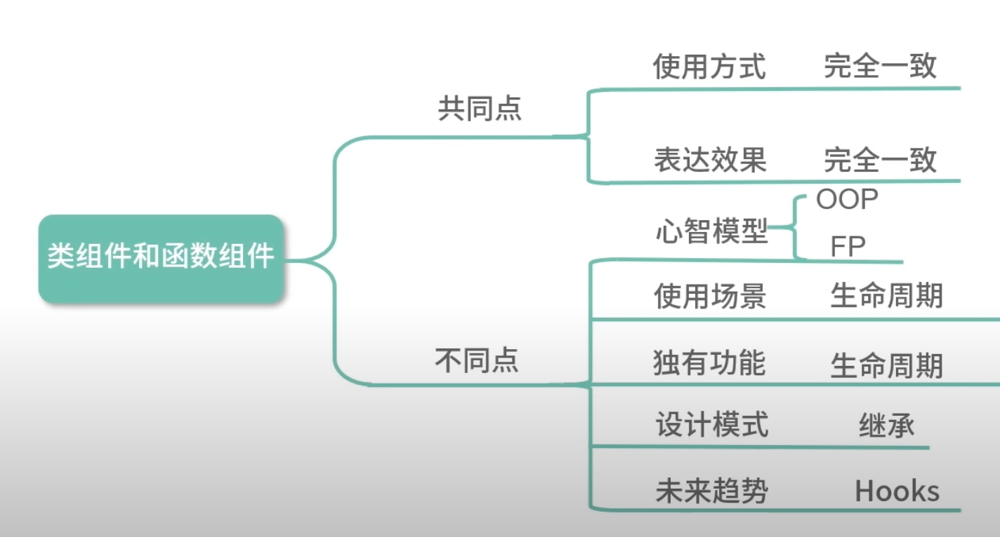
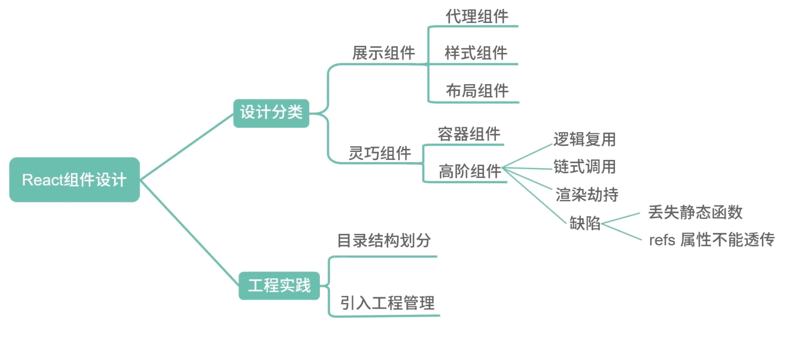
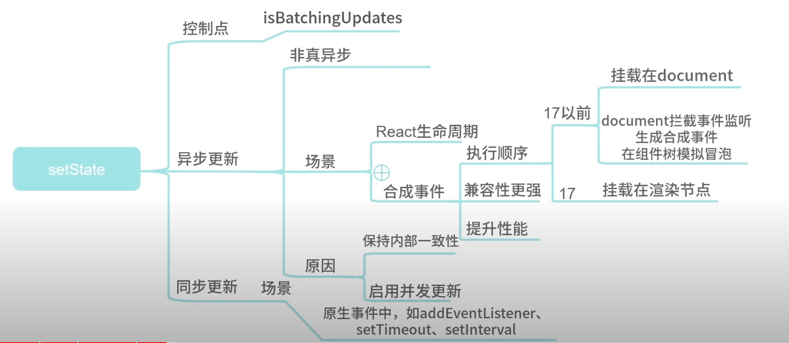
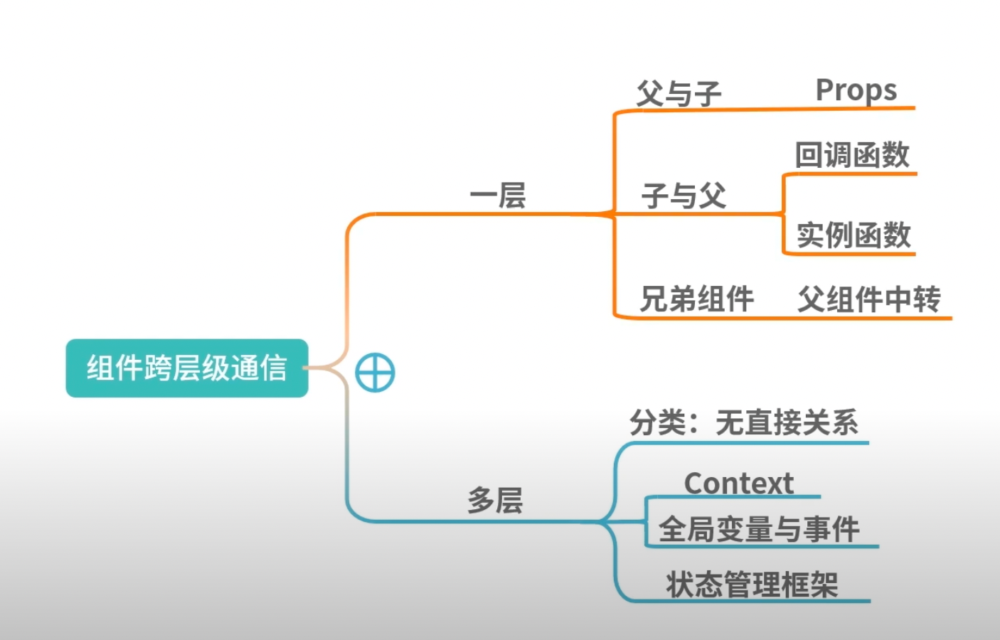
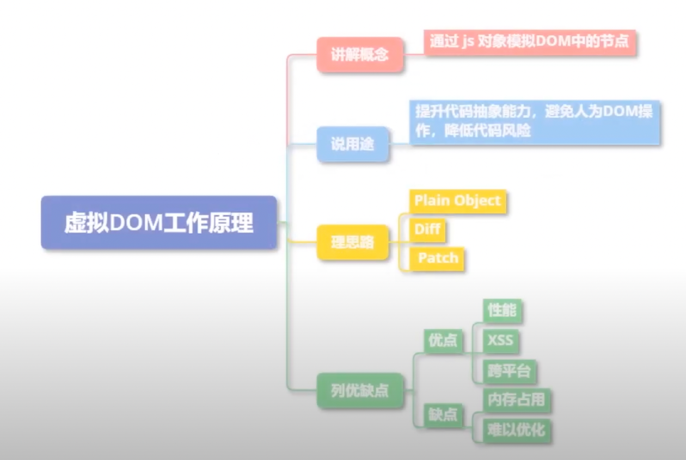
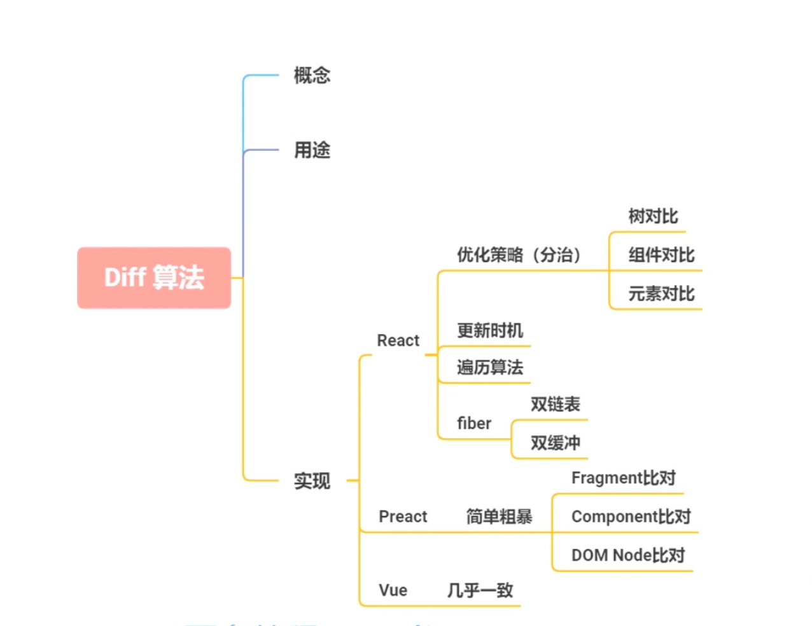
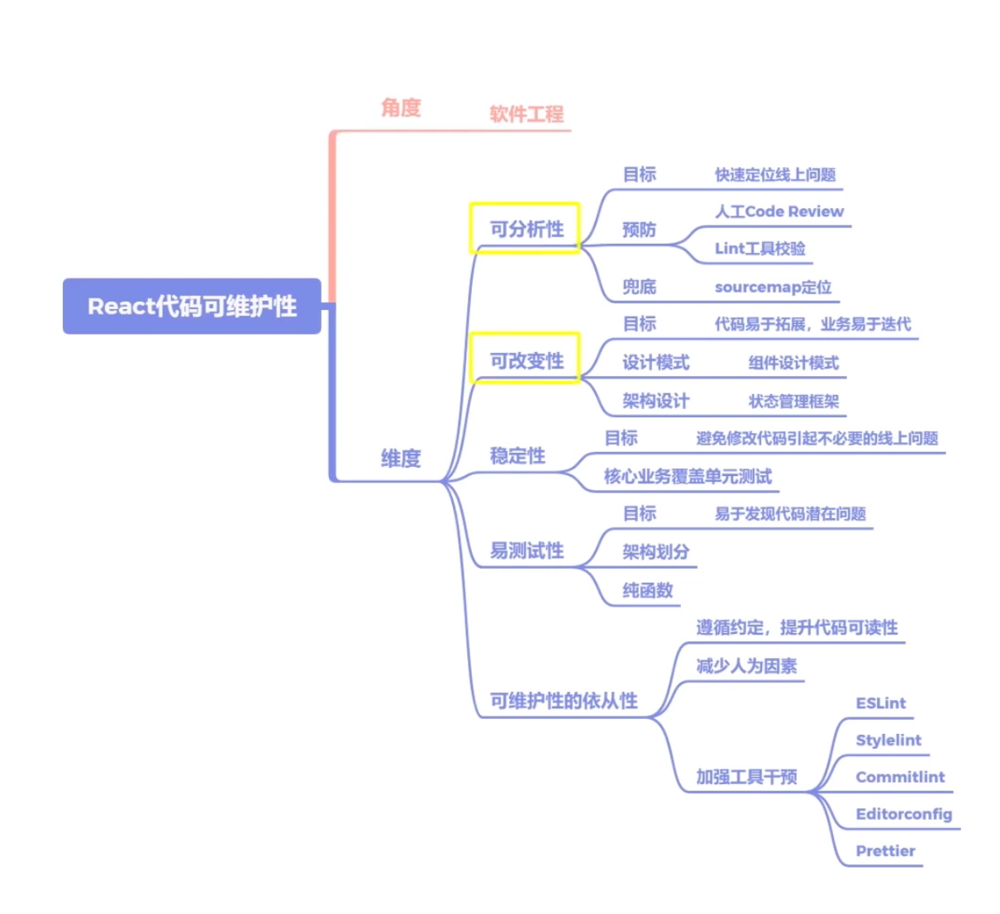
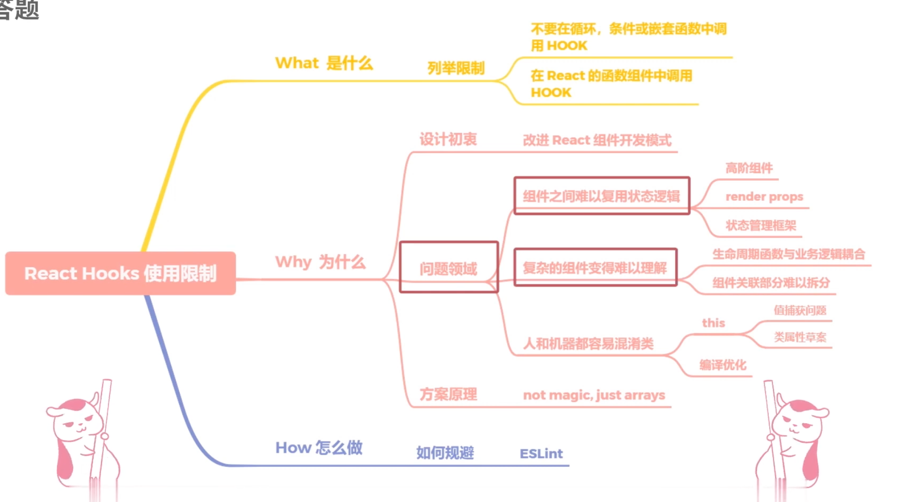

react

  - JSX语法
  - 单向数据流
  - 虚拟dom
  - 声明式编程
  - Component

### Component

一切皆是组件 函数/类

  - 可组合
  - 可重用
  - 可维护

```
 无状态组件
 const Header = () => {
    return (
      <Button>按钮</Button>
    )
 }
```

```
 有状态组件
 class Header extends React.Component {
  constructor(props){
    super(props)
    this.state = {}
  }
  render(){
    
  }
 } 
```

## 优势
- 高效: 对DOM模拟 不直接操作真是DOM
- 灵活: 只是一个JS库 和别的框架可以完美配合
- 跨浏览器兼容
- 声明式设计
- 组件式开发
- 单向数据流: 安全可控

## react是什么

答题
React是一个网页UI框架，通过组件化的方式解决视图层开发复用的问题，本质是一个组件化框架。
它的核心设计思路有三点，分别是声明式、组件化与通用性。
声明式的优势在于直观与组合。
组件化的优势在于视图的拆分与模块复用，可以更容易做到高内聚低耦合。
通用性在于一次学习，随处编写。比如React Native,React360等，这里主要靠虚拟DOM来保证实现。
这使得React的适用范围变得足够广，无论是Web、Native、VR,甚至Shell应用都可以进行开发。这也
是React的优势。
但作为一个视图层的框架，React的劣势也十分明显。它并没有提供完整的一揽子解决方案，在开发大型前
端应用时，需要向社区寻找并整合解决方案。虽然一定程度上促进了社区的繁荣，但也为开发者在技术选型
和学习适用上造成了一定的成本。
后面可以拓展例如

- 自己对React优化的看法, 对虚拟dom的看法
- React相关的工程架构与设计模式

## react为什么要用jsx
三步走技巧:一句话解释JSX 核心概念 方案对比
react 设计初衷: 代码关注点分离
答题:
一句话解释JSX jsx是js语法拓展, 用于声明react元素, 但是react并不强制要求使用, 即使使用了也会在构建中用babel转换成react.createElement
核心概念 jsx更像是react.createElement一个语法糖 react团队并不想引入js以外的概念
方案对比 模板 (引入了其他概念 )模板字符串(结构描述复杂, 语法提示差)


## babel是如何工作的

## 如何避免生命周期的坑
- 类组件才有这个问题 函数组件从头执行到尾

不在恰当的时候,调用不该调用函数
需要调用的时候不要忘记调用

## 类组件与函数组件的区别
求同存异~

相同点: 作为基础组件展示UI
不同点: 
类组件是面向对象编程
函数组件是函数式编程 纯粹 简单 易测试



## 如何设计react组件
 --react 设计模式
无状态组件,展示组件  通用型强,复用率高,数据主要来源于props  代理组件的模式 样式组件, 布局组件
有状态组件,灵巧组件  复杂度高 容器组件 高阶组件



## setState 同步? 异步?
不同的场景,结果是不同的~



## 面上组件跨层级通信



## 虚拟Dom

- 优势
  1. 改善大规模DOM操作性能
  2. 低成本跨平台
  3. 避免XSS, 但是依然有dangeeroushtml API的存在

- 缺点
  1. 内存占用较高
  2. 无法极致优化


## diff算法


根据diff算法的设计原则，应尽量避免跨层级节点移动
通过设置唯一key进行优化，尽量减少组件层级深度
因为过深的层级会加深遍历深度，带来性能问题
设置shouldComponentUpdate或者React.pureComponet减少diff次数


## React渲染流程

阶段划分 

协调:
Stack Reconciler是React15及以前版本的渲染方案, 其核心是以递归的方式逐级调度栈中子节点到父节点的渲染
fiber Reconciler是React16及以后版本的渲染方案，核心设计是增量渲染，将渲染工作分割为多区块，将其分散到多个帧中执行

react渲染的整体策略是递归,并通过事务建立react与虚拟dom的联系并完成调度

## React渲染异常怎么办
从预防+兜底两个角度讲
兜底的页面展示并且可以及时上报

## 如何性能分析和优化
建立衡量标准(指标,采集)
确认优化原因
实施方案过程

## 维护






